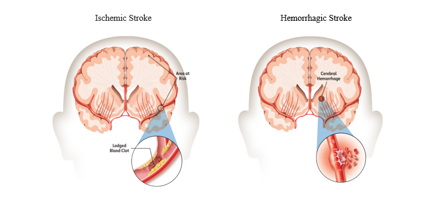
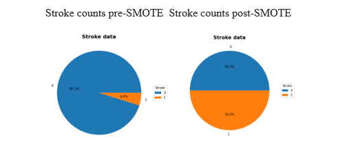

# Stroke_Analysis_and_Prediction
Use of Machine Learning and Tableau Dashboards to Help Predict Strokes and Understand Contributing Factors

## <a href="https://stroke-analysis-and-prediction.herokuapp.com/">Heroku  - Stroke Analysis and Prediction</a> 

## Objective
To develop a model which can reliably predict the likelihood of a stroke using patient input information.

## Programs Used

•  Python 

•  Pandas 

•  Jupyter Notebook 

•  JavaScript 

•  HTML5/CSS 

•  scikit-learn 

•  imbalanced-learn 

## Introduction
Cerebrovascular accidents (strokes) in 2020 were the 5th [1] leading cause of death in the United States.

A stroke occurs when the blood supply to a region of the brain is suddenly blocked or when a rupture occurs starving the brain cells of oxygen and nutrients.  Blockage obstructing the flow of blood to a region of the brain is called an ischemic stroke and accounts for 87%[2] of all strokes.  The rupturing of a blood vessel is called a hemorrhagic stroke and accounts for 13%[3] of all strokes.
 
 

 
 
 Source of images [4] 

 A third category of stroke called a transient ischemic attack (TIA), or "mini stroke", caused by a temporary clot can also occur. The TIA has contributing factors similar to those of the ischemic and hemorrhagic stroke. 

Per the American Stroke Association, 80% of strokes are preventable [5] .

## Hypothesis
Hypothesis: A reliable predictive model can be developed if the data and stroke key attributes are correctly identified and prepared for the machine learning process.

The importance of features generated by the model selected will be compared against the stroke risk factors identified by the American Stroke Association.

If the attributes are correctly identified by the model, the hypothesis will be considered validated.

Basis Risk Factors from American Stroke Association common to the dataset.

•  High Blood Pressure

•  Smoking

•  Diabetes

•  Obesity

•  Heart Disease
 

•  Age (cannot be controlled)

•  Gender (cannot be controlled)

## Data
Data is from Kaggle [6]

The raw dataset for machine learning consists of 5110 unique rows. Each row contains patient information designated by a unique id.

There were 2,994 (58.60%) “Females”, 2,115 (41.40%) “Males” and 1 “Other” in the gender attribute.  The “Other” gender was dropped from the dataset for a resulting dataset of 5,109 unique rows.

### Trends identified in the dataset

92% of strokes occur over the age of 50.
 
 

 
 
The charts below are used to represent the general data characteristics defined by Yes/No answers.  The attributes are in stacked panes for comparison purposes and the wider and darker brown bars indicate the higher normalized values.

The values associated with each bar are number of individuals in the designated age range, the normalized percentage of strokes in that range and the total number of individuals suffering a stroke in that range. 
 
The lower Percentage of Not Married for Age Range 80+ could include individuals whose spouses have died and therefore where not married at the time of the stroke. The phrasing of the question and related answer could have inadvertently redirected the overall results for the age range.

Age Range 80+ generally has the highest percentage of strokes on a normalized basis.
 
 

 
 
Comorbidities BMI, Glucose (Blood Sugar) and Smoker Status data are represented in the chart below.  BMI (Overweight and Obese), Glucose (Diabetic Risk and Diabetic) and Smoker Status (Formerly Smoked and Current Smoker) have the highest normalized stroke percentages.  The wider and darker brown bars indicate the higher normalized values.

The glucose data presented in the dataset is average glucose value. Depending on when a person has eaten, a glucose value can have significant swings in values. Therefore, to create a Glucose Category that can used to filter the data, a blending of Fasting, Just Eaten and Several Hours after eating ranges were merged into ranges.  
 
 

 
 

## Visualizations
The data is represented in Tableau.  The markers on each bar represents the total count, stroke total and stroke normalized percentage for the respective filter settings. The values associated with the gender bubbles are total count of the respective gender, total strokes, and stroke normalized percentage for the filter settings.  The last pane is a bubble chart representing all the data in the dataset.  When hovering over a bubble, information associated with the individual is presented.  All panes are tied into the filters and correspond with updated data after each selection.   
 
 
 
 
 
Additional data sources were used to supplement the stroke visualization effort.  The data was used to create a map of stroke mortality [7] (geographic location) and associated statistics [8].  
 
 
  
 
 
  
 
 
  
 
 

## Data Cleaning and Imputation
In reviewing the raw data, the bmi attribute was identified as having 201 “N/A” values.  This represents 3.9% of the dataset.  The mean bmi value of 28.89 was used as the replacement value for the “N/A” values. 

The raw dataset has a total 1,544 “Unknown” smoking status values representing 30.4% of the dataset.  A closer look at the data showed 32% of the “Unknown” values were between the ages of 0-10 and 41% was between the ages of 0-15.    The Centers for Disease Control and Prevention (CDC) defines a current smoker [9] as an Adult who has previously smoked 100 cigarettes in their lifetime and who currently smokes.  Based on the CDC definition and the high percentage of “Unkown” values in the age range 0-10, it was originally discussed to replace those values with “never smoked”.   Additional research of online literature to address this issue of “Unknown” labels was conducted and it was found that “Unknown” is an accepted category.   The final decision was made to leave the “Unknown” smoker status values as presented in the raw dataset.
   
One-Hot Encoding was used for categorical data work_type and smoking_status to be used in the linear and tree models. 
 
 
 
 
 

## Data Exploring
Most of the data was biased in the histograms, except for age and Residence_type. For the Yes/No questions, the data was left biased correlating to 0 which presents No as the answer to the respective question.   The attributes bmi and average_glucose_level were left biased representing the lower end of their broad spectrum of data points. 
 
 

## Correlation Heat Map
The correlation heat map is presented below.  Values closer to zero indicate minimal to no linear relationship.  The more positively correlated attributes approach 1, meaning as one attribute increases so does the other.    The more negatively correlated attributes approach -1, meaning as one attribute increases the other decreases.
 
 
 
 
 

## Addressing Data Bias
There is a large imbalance of stroke incidents in the dataset.  To improve the model learning capabilities, bias was addressed using Synthetic Minority Oversampling Technique (SMOTE). 
 
SMOTE utilizes k-nearest neighbor technique to create synthetic data.  In this case, increase the number of stroke “Yes” values.  SMOTE randomly chooses data from the stroke “Yes” values and then the respective k-nearest “No” neighbors.  Synthetic “Yes” values are continually made until they closely match the “No” values.   See before and after percentages below.  
 
 
 
 
 

## Machine Model Evaluation
The primary objectives of the model evaluation process were to identify a model that did not overfit the data, generated the highest f1-score for 1 (“Yes” for stroke) and generated the highest recall for “Yes”.  The large number of 0 values (“No” for stroke), ensured a good f1-score for 0, but our objective was to identify a model that will give the best “Yes” result.  That presented a challenge for the models.  As noted above, SMOTE was used to help with this issue.

### Linear Models

Models evaluated were LogisticRegression, KNeighborsClassifier and Support Vector Machines (svm).  

The best results for the linear model was LogisticRegression with an Out Sample f1-score of 0.23.  KNeighborsClassifier and svm gave 0.16 and 0.19, respectively.

### Tree Models

Models evaluated were DecisionTreeClassifier, RandomForestClassifier, AdaBoostClassifier, GradientBoostingClassifier and XGBClassifier. 

The best results for the tree models were AdaBoostClassifier and GradientBoostingClassifier with Out Sample f1-scores of 0.24 and 0.26, respectively.  DecisionTreeClassifier, RandomForestClassifier and XGBClassifier gave 0.13, 0.16 and 0.14, respectively.

Upon further evaluation, AdaBoostClassifier and, GradientBoostingClassifier gave recall values of 0.30 and 0.20.  In each case, the models had a high value of missed 1 (“Yes” for Stroke) in the Out Samples.

## Model Selection
When reviewing the best of the respective Liner and Trees models, the Tree models had the best f1-scores, but extremely poor recall values.  Therefore, the Liner model was selected with a little lower f1-score, but much better recall value.
 
 

 
 

## Feature Importance
Feature importance is presented below.  The chart presents the assigned value of the relationship between stroke and identified attribute.  Like the correlation heat map, the values closer to zero indicate minimal to no linear relationship.  The more positively correlated attributes approach 1, meaning as one attribute increases so does the other.    The more negatively correlated attributes approach -1, meaning as one attribute increases the other decreases.
 
 

 
 

## Conclusion
Objective: To determine if a reliable model was developed, the risk factors identified by the American Stroke Association will be compared against the Features Importance table and live data will be tested.

Revisiting the Hypothesis criteria

Basis Risk Factors from American Stroke Association common to the dataset.

•  High Blood Pressure

•  Smoking

•  Diabetes

•  Obesity

•  Heart Disease
 

•  Age (cannot be controlled)

•  Gender (cannot be controlled)

### Hypothesis Validated

The top eleven in the Feature Importance chart:

•  Age

•  Heart disease

•  Diabetes (avg_glucose_level)

•  High Blood Pressure (Hypertension)

•  Married

•  Smoking (smoking_status_former & smoking_status_smokes)

•  work_type_self-employed  & work_type_Private 

•  Obesity (bmi)

•  Gender

Married and both work_type attributes we picked up as dateset dependencies.

The risk factors from the American Stroke Association have been identified in the Feature Importance chart with positive values. 

## Actionable Items
This model is one of many tools which are needed to increase awareness and help reduce stroke incidents.  As the noted above, the American Stroke Association states that 80% of strokes are preventable.   

### Actionable item

Support stroke prevention awareness programs such as:

•  Exercise

•  Eating correctly

•  Programs to stop smoking

## References
[1] Ahmad FB, Cisewski JA, Miniño A, Anderson RN. Provisional Mortality Data — United States, 2020. MMWR Morb Mortal Wkly Rep 2021;70:519–522. DOI https://www.cdc.gov/mmwr/volumes/70/wr/mm7014e1.htm?s_cid=mm7014e1_w#F1_down

[2] American Stroke Association, https://www.stroke.org/en/about-stroke/types-of-stroke/ischemic-stroke-clots

[3] American Stroke Association, https://www.stroke.org/en/about-stroke/types-of-stroke/hemorrhagic-strokes-bleeds

[4] American Stroke Association, Explaining Stroke, pages 1-20, https://www.stroke.org/-/media/stroke-files/stroke-resource-center/brochures/explaining_stroke_brochure_6_25_19.pdf?la=en

[5] American Stroke Association, https://www.stroke.org/en/about-stroke

[6] Stroke Prediction Dataset, 11 clinical features por predicting stroke events, https://www.kaggle.com/fedesoriano/stroke-prediction-dataset

[7] Stroke Mortality Data Among US Adults (35+) by State…2016, Dataset in U.S. Department of Health & Human Services, https://data.world/us-hhs-gov/12ea7a13-b229-43b4-b19b-1459e9a64d3f

[8] USDA Economic Research Service, U.S. Department of Agriculture, https://www.ers.usda.gov/data-products/county-level-data-sets/download-data/

[9] Centers for Disease Control and Prevention, National Center for Health Statistics, https://www.cdc.gov/nchs/nhis/tobacco/tobacco_glossary.htm

